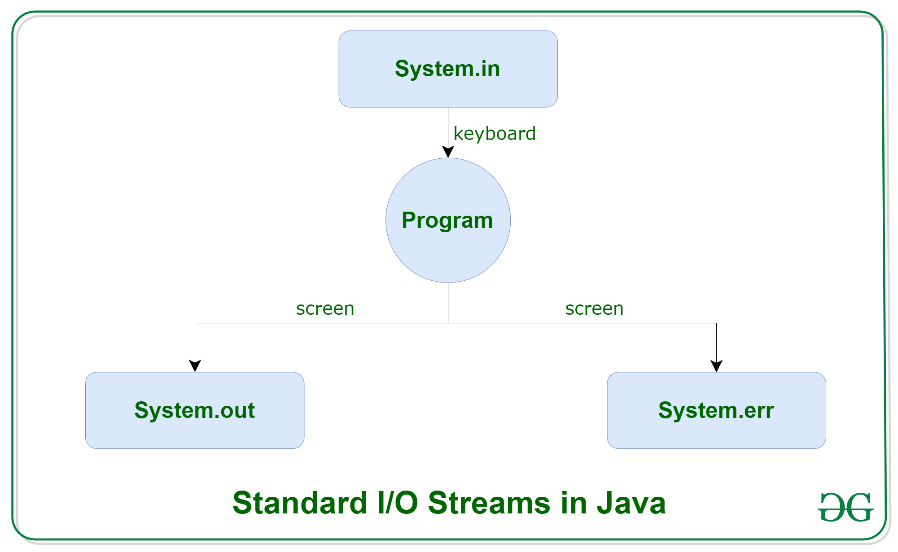
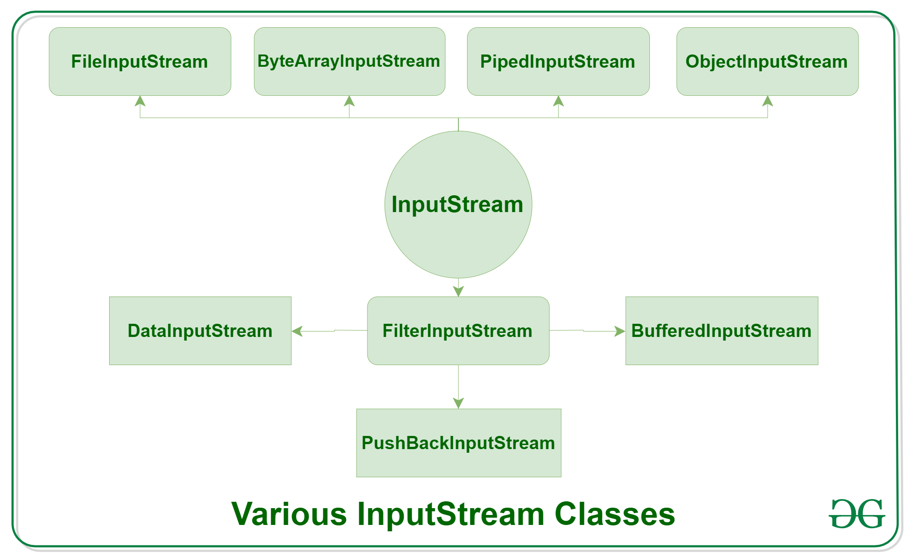
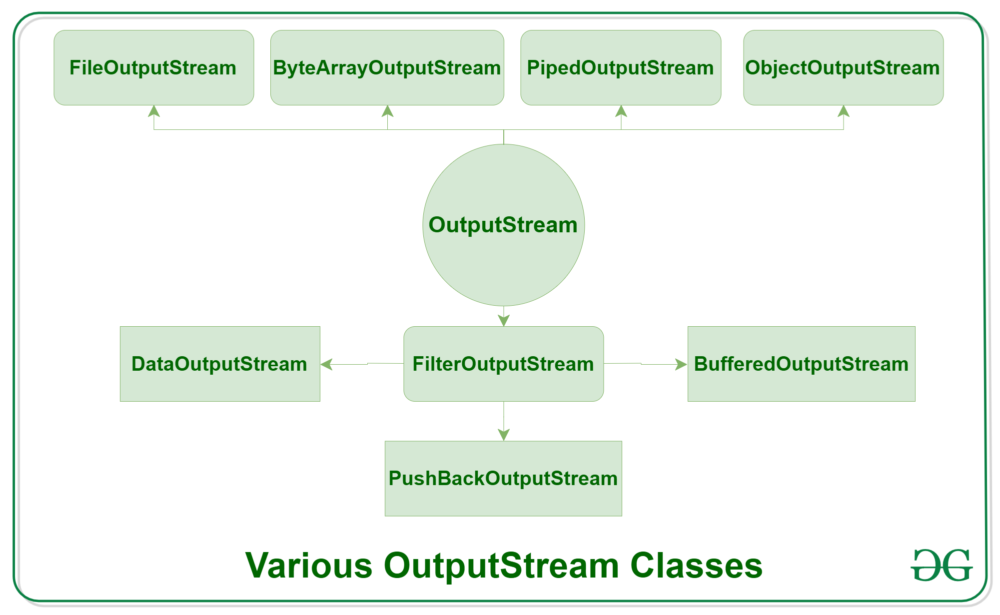
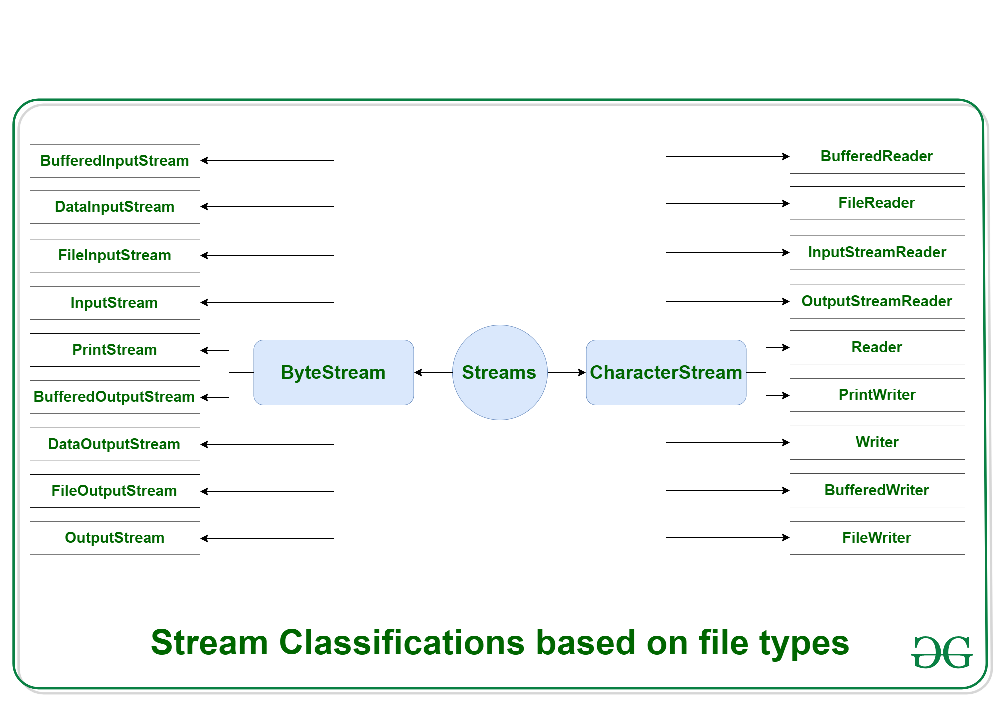

# Java Training - I/O Streams
Java Training I/O Streams examples

Java supports three streams that are automatically attached with the console.

- System.out: Standard output stream
- System.in: Standard input stream
- System.err: Standard error stream

Standard Streams

## Types of Streams: Operation

Depending on the <B>type of operations</B>, streams can be divided into two primary classes:

- Input Stream: These streams are used to read data that must be taken as an input from a source array or file or any peripheral device. For eg., FileInputStream, BufferedInputStream, ByteArrayInputStream etc.

Input Streams

- Output Stream: These streams are used to write data as outputs into an array or file or any output peripheral device. For eg., FileOutputStream, BufferedOutputStream, ByteArrayOutputStream etc.

Output Streams

## Types of Streams: Kind of File

Depending on the <B>types of file</B>, Streams can be divided into two primary classes which can be further divided into other classes as can be seen through the diagram below followed by the explanations.

Type of file

### ByteStream

ByteStream: This is used to process data byte by byte (8 bits). 

Though it has many classes, the FileInputStream and the FileOutputStream are the most popular ones. 
The FileInputStream is used to read from the source and FileOutputStream is used to write to the destination. 

Here is the list of various ByteStream Classes:

| Stream class	| Description |
| :---------------- | :------ |
|BufferedInputStream|	used for Buffered Input Stream.|
|DataInputStream	|contains method for reading java standard datatypes.|
|FileInputStream	|used to reads from a file|
|InputStream	|an abstract class that describes stream input.|
|PrintStream	|contains the most used print() and println() method|
|BufferedOutputStream	| used for Buffered Output Stream.|
|DataOutputStream	| contains method for writing java standard data types.|
|FileOutputStream	|used to write to a file.|
|OutputStream	|an abstract class that describe stream output.|

### CharacterStream
CharacterStream: In Java, characters are stored using Unicode conventions. 

Character stream automatically allows us to read/write data character by character. Though it has many classes, the FileReader and the FileWriter are the most popular ones. FileReader and FileWriter are character streams used to read from the source and write to the destination respectively. 

Here is the list of various CharacterStream Classes:

|Stream class|	Description|
| :---------------- | :------ |
|BufferedReader	|used to handle buffered input stream.|
|FileReader	|an input stream that reads from file.|
|InputStreamReader	|input stream is used to translate byte to character.|
|OutputStreamReader	|output stream is used to translate character to byte.|
|Reader	|an abstract class that define character stream input.|
|PrintWriter	|contains the most used print() and println() method|
|Writer	|an abstract class that define character stream output.|
|BufferedWriter	|used to handle buffered output stream.|
|FileWriter	|used to output stream that writes to file.|

